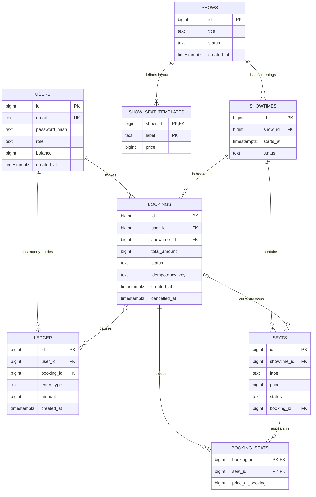

# Booking System: Database Schema Notes (Phase 2)

These notes continue from `01-setup-notes.md` (environment) and `02-system-plan.md` (flows, routes, build plan). They cover **only what happened after those two documents**: wiring `init.sql`, designing and creating the database schema, and every decision behind it.

---

## 1. What happened, in order

1. **Wired `db/init.sql` into the PostgreSQL container** so SQL written there runs automatically.
2. **Started the `users` table** and discussed why each column exists.
3. **Decided where the admin lives** (a row in `users`, not a separate table).
4. **Introduced recurring shifts** (3 per day, every day), which split "show" into a *template* and *showtimes*.
5. **Wrote the full schema** (8 tables) and created it in the database.

---

## 2. How `init.sql` runs

In `docker-compose.yml`, under the `postgres` service volumes, one line was added:

```
./db/init.sql:/docker-entrypoint-initdb.d/init.sql
```

- The left side is the file on Windows, the right side is the path inside the container.
- The PostgreSQL image runs every `.sql` file in `/docker-entrypoint-initdb.d/` **only the first time the database is created**, that is, when the `pgdata` volume is empty.
- After the first run, editing `init.sql` has **no effect**. To apply a schema change during development, wipe the volume and start again:
  ```
  docker compose down -v
  docker compose up -d
  ```
  This deletes all data, which is fine while there is no real data. It must be done carefully later.
- The file must **exist before** Docker mounts it. If it does not exist, Docker creates a *folder* with that name and PostgreSQL gets confused.
- Verified by the log line `running /docker-entrypoint-initdb.d/init.sql`.
- Tip: `psql` shows long output page by page (`--More--`). Use `psql -P pager=off ...` to print everything at once.

**Rule kept from before:** never create tables by hand in pgAdmin. Everything lives in `init.sql`, so the whole database can be rebuilt with one command.

---

## 3. Decisions and the reasons behind them

| # | Decision | Reason |
|---|---|---|
| 1 | IDs are `BIGINT GENERATED ALWAYS AS IDENTITY`, not UUID | We lock rows in **sorted id order** to avoid deadlocks, and plain numbers sort naturally. `GENERATED ALWAYS` stops anyone from inserting a manual id. |
| 2 | Uniqueness (email, seat label, idempotency key) is enforced **by the database** | Application code can have bugs or race conditions. A unique constraint cannot be bypassed. |
| 3 | The **admin is a row in `users`** with `role = 'admin'` | One login flow, one password-hash format, and the ledger can point to a single users table. A second `admins` table would force the ledger to reference two tables. |
| 4 | A **partial unique index** allows only one admin | The database itself refuses a second admin, even if an API bug tried to create one. |
| 5 | The admin's password is **not** in `init.sql` | The SQL file goes to GitHub, and hashing is done by application code. The admin is created at app startup from `ADMIN_EMAIL` and `ADMIN_PASSWORD` in `.env` (to be built in the Auth phase). |
| 6 | `role` and `status` are `TEXT` with `CHECK`, not PostgreSQL `ENUM` types | Easier to change later, and the CHECK still rejects invalid values. |
| 7 | **Money is `BIGINT`** (paise) everywhere | Floating point cannot represent money exactly. |
| 8 | **Ledger instead of an admin balance** | If every booking updated one admin balance row, all bookings would queue behind that row's lock (a hot row). Inserting ledger rows has no such contention. Admin earnings = sum of the admin's ledger entries. |
| 9 | Users still keep a `balance` column | A user's contention is only between that user's own requests, so a guarded per-user balance is cheap and makes the "no overspending" check simple. The ledger records every movement for audit. |
| 10 | **Shows are split into `shows` (template) and `showtimes` (real screenings)** | Needed for the "3 shifts every day" requirement. See section 4. |
| 11 | Seats are **not reset**; new showtimes get fresh seat rows | Resetting would destroy booking history, break the link between money and seats, and create a race during the reset. |
| 12 | Deleting a show is a **soft delete** (`status = 'CANCELLED'`) | Keeps history and lets the scheduler simply stop generating new showtimes. |
| 13 | `booking_seats` stores `price_at_booking` | A later price change must never rewrite what a past booking cost. |
| 14 | `seats` only knows `AVAILABLE` or `BOOKED`; **HELD lives in Redis only** | Holds are temporary and expire by TTL. The database stores only permanent facts. |
| 15 | Many rules are written as `CHECK` constraints | They are the last safety net: if application code is wrong, the database still refuses an impossible state. |
| 16 | Table creation order follows foreign keys | A table can only reference a table that already exists. `bookings` is created before `seats` because `seats.booking_id` points to it. |

---

## 4. Recurring shifts: why `shows` became two tables

**Requirement:** every show runs in 3 shifts per day (8 hours apart) and repeats every day. Tickets must become available again for each new shift whether or not anyone booked before.

**Rejected approach:** a job that runs every 8 hours and sets all seats back to `AVAILABLE`. Problems:
- A past booking would point to a seat that now looks free.
- The ledger shows money taken while the seat looks unsold.
- The reset itself would race with users who are booking at that moment.

**Chosen approach:** every shift on every day is its own **showtime** row, with its own **seat** rows.
- The morning shift's seats stay `BOOKED` forever as history.
- The evening shift's seats are separate rows that start `AVAILABLE`.
- Nothing is ever reset. "Tickets refresh" simply means *new showtimes and seats are created ahead of time*.

**How showtimes get created:** a small scheduler inside the app will periodically make sure the next N days of showtimes exist (default: 2 days ahead) and copy the seat layout and prices from `show_seat_templates` into new `seats` rows.
- The job is **idempotent**: `UNIQUE (show_id, starts_at)` plus `INSERT ... ON CONFLICT DO NOTHING` means that running it twice, or on two app instances, never creates duplicates.
- Shift times (suggested 08:00, 16:00, 00:00 IST) will live in configuration, not in the schema.

---

## 5. ER diagram



Reading the diagram: `||` means exactly one, `o|` means zero or one, `o{` means zero or many. For example, one user makes many bookings, and a seat belongs to zero or one booking at a time.

---

## 6. Foreign key map

| Table.column | References | Meaning | Nullable? |
|---|---|---|---|
| `show_seat_templates.show_id` | `shows.id` | Which show this seat layout belongs to | No |
| `showtimes.show_id` | `shows.id` | Which show this screening is of | No |
| `bookings.user_id` | `users.id` | Who made the booking | No |
| `bookings.showtime_id` | `showtimes.id` | Which screening it is for | No |
| `seats.showtime_id` | `showtimes.id` | Which screening this seat belongs to | No |
| `seats.booking_id` | `bookings.id` | Booking that currently owns the seat | **Yes** (null while available) |
| `booking_seats.booking_id` | `bookings.id` | Which booking | No |
| `booking_seats.seat_id` | `seats.id` | Which seat | No |
| `ledger.user_id` | `users.id` | Whose account the entry belongs to (users and the admin) | No |
| `ledger.booking_id` | `bookings.id` | Booking that caused the money movement | **Yes** (null for signup bonus) |

Chain to remember: `shows → showtimes → seats`, and `users → bookings → booking_seats`, with `ledger` hanging off `users` and `bookings`.

---

## 7. Tables in detail

### 7.1 `users`: everyone who can log in, including the admin

**Purpose:** identity, role and wallet balance.

| Column | Type and rules | Why |
|---|---|---|
| `id` | BIGINT identity, primary key | Unique id; numeric so rows can be locked in sorted order. |
| `email` | TEXT, NOT NULL, UNIQUE | Login name. Uniqueness enforced by the database. The app will lowercase emails before storing, because `A@x.com` and `a@x.com` are different strings to PostgreSQL. |
| `password_hash` | TEXT, NOT NULL | Hashed password. The plain password is never stored. |
| `role` | TEXT, NOT NULL, default `'user'`, CHECK in (`user`, `admin`) | Decides what the JWT allows. Default is the safe, low-privilege value. |
| `balance` | BIGINT, NOT NULL, default 0, CHECK `>= 0` | The user's wallet in paise. The CHECK means the database refuses to let it go negative even if two requests race. Not used for the admin (the admin's earnings come from the ledger). |
| `created_at` | TIMESTAMPTZ, default `now()` | Audit information. Time zone aware. |

**Extra rule:** unique partial index `one_admin_only ON users (role) WHERE role = 'admin'` allows at most one admin row.

### 7.2 `shows`: the template of what is playing

**Purpose:** what the admin creates. It describes a show in general, not a particular date.

| Column | Type and rules | Why |
|---|---|---|
| `id` | BIGINT identity, primary key | Identifier. |
| `title` | TEXT, NOT NULL | Name of the show or movie. |
| `status` | TEXT, NOT NULL, default `'ACTIVE'`, CHECK in (`ACTIVE`, `CANCELLED`) | "Deleting" a show sets `CANCELLED`. The scheduler stops creating new showtimes and history is kept. |
| `created_at` | TIMESTAMPTZ, default `now()` | Audit information. |

### 7.3 `show_seat_templates`: seat layout and price chosen by the admin

**Purpose:** remembers which seats a show has and what each seat costs, so every new showtime can copy it.

| Column | Type and rules | Why |
|---|---|---|
| `show_id` | BIGINT, FK to `shows` | Which show. |
| `label` | TEXT | Seat name such as `A1`. |
| `price` | BIGINT, CHECK `> 0` | Price per seat in paise. This is how the admin sets **each seat's price**. |

Primary key is `(show_id, label)`, so one show cannot have the same seat label twice.

### 7.4 `showtimes`: one real screening (show + date + shift)

**Purpose:** the thing users actually book. Each shift of each day is one row.

| Column | Type and rules | Why |
|---|---|---|
| `id` | BIGINT identity, primary key | Identifier used by seats, bookings and holds. |
| `show_id` | BIGINT, NOT NULL, FK to `shows` | Which show this is a screening of. |
| `starts_at` | TIMESTAMPTZ, NOT NULL | When it starts. Bookings are refused at or after this time (using database time). |
| `status` | TEXT, NOT NULL, default `'ACTIVE'`, CHECK in (`ACTIVE`, `CANCELLED`) | Lets a single screening be cancelled. |

- `UNIQUE (show_id, starts_at)` makes the scheduler safe to run repeatedly.
- Index on `starts_at` for listing upcoming showtimes quickly.

### 7.5 `bookings`: one successful purchase

**Purpose:** records that a user bought a set of seats for a showtime.

| Column | Type and rules | Why |
|---|---|---|
| `id` | BIGINT identity, primary key | Identifier. |
| `user_id` | BIGINT, NOT NULL, FK to `users` | Buyer. |
| `showtime_id` | BIGINT, NOT NULL, FK to `showtimes` | Which screening. |
| `total_amount` | BIGINT, NOT NULL, CHECK `> 0` | Total paid, in paise. |
| `status` | TEXT, NOT NULL, default `'CONFIRMED'`, CHECK in (`CONFIRMED`, `CANCELLED`) | Lifecycle. Cancelling changes this, rows are never deleted. |
| `idempotency_key` | TEXT, NOT NULL | The client's unique key for this attempt. Every booking request must carry one. |
| `created_at` | TIMESTAMPTZ, default `now()` | When the booking was made. |
| `cancelled_at` | TIMESTAMPTZ, nullable | When it was cancelled. |

- `UNIQUE (user_id, idempotency_key)`: the database-level guard against duplicate bookings from a retry or double click. Redis is the first line of defence, this is the last.
- `CHECK ((status = 'CANCELLED') = (cancelled_at IS NOT NULL))`: a booking has a cancel time if and only if it is cancelled.
- Indexes on `user_id` (my bookings) and `showtime_id` (admin view).

### 7.6 `seats`: the individual seats of one showtime

**Purpose:** the inventory that users compete for. These rows are what `SELECT ... FOR UPDATE` locks.

| Column | Type and rules | Why |
|---|---|---|
| `id` | BIGINT identity, primary key | Used for sorted locking. |
| `showtime_id` | BIGINT, NOT NULL, FK to `showtimes` | Which screening the seat belongs to. |
| `label` | TEXT, NOT NULL | Seat name, such as `A1`. |
| `price` | BIGINT, NOT NULL, CHECK `> 0` | Price copied from the template when the showtime is created. |
| `status` | TEXT, NOT NULL, default `'AVAILABLE'`, CHECK in (`AVAILABLE`, `BOOKED`) | Permanent state. "Held" is not stored here. |
| `booking_id` | BIGINT, nullable, FK to `bookings` | The booking that currently owns the seat. |

- `UNIQUE (showtime_id, label)`: no duplicate labels in a showtime.
- `CHECK ((status = 'BOOKED') = (booking_id IS NOT NULL))`: a seat is booked if and only if a booking owns it. This makes "booked but nobody owns it" impossible.
- Index on `showtime_id` for building the seat map.

### 7.7 `booking_seats`: which seats were in which booking (history)

**Purpose:** a permanent record. `seats.booking_id` is cleared when a booking is cancelled and the seat is sold again, so without this table the past would be lost.

| Column | Type and rules | Why |
|---|---|---|
| `booking_id` | BIGINT, FK to `bookings` | The booking. |
| `seat_id` | BIGINT, FK to `seats` | The seat. |
| `price_at_booking` | BIGINT, CHECK `> 0` | The price actually paid for this seat, even if prices change later. |

Primary key is `(booking_id, seat_id)`, so a seat appears at most once in a booking.

### 7.8 `ledger`: insert-only record of every money movement

**Purpose:** the source of truth for money and for the admin's earnings. Rows are only added, never updated or deleted.

| Column | Type and rules | Why |
|---|---|---|
| `id` | BIGINT identity, primary key | Gives a stable order. |
| `user_id` | BIGINT, NOT NULL, FK to `users` | Whose account the entry belongs to. The admin is a user row, so admin entries use the admin's id. |
| `booking_id` | BIGINT, nullable, FK to `bookings` | Booking that caused it. Null only for a signup bonus. |
| `entry_type` | TEXT, NOT NULL, CHECK in the list below | Why the money moved. |
| `amount` | BIGINT, NOT NULL | Signed: positive adds money to that account, negative removes it. |
| `created_at` | TIMESTAMPTZ, default `now()` | When it happened. |

**Entry types and their signs**

| Type | Who | Sign | When |
|---|---|---|---|
| `SIGNUP_BONUS` | user | `+` | Registration (money enters the system) |
| `BOOKING_PAYMENT` | user | `-` | Booking confirmed |
| `BOOKING_CREDIT` | admin | `+` | Booking confirmed (same booking, the matching entry) |
| `REFUND_DEBIT` | admin | `-` | Booking cancelled |
| `REFUND_CREDIT` | user | `+` | Booking cancelled (the matching entry) |

**Checks:** credits must be positive and debits negative; `booking_id` must be null exactly when the type is `SIGNUP_BONUS`. Indexes on `user_id` and `booking_id`.

**Admin earnings** = `SUM(amount)` of ledger rows where `user_id` is the admin.

---

## 8. What the database now refuses on its own

| Rule | Prevents |
|---|---|
| `users.balance >= 0` | A negative wallet |
| `one_admin_only` index | A second admin |
| `users.email` unique | Duplicate accounts |
| `UNIQUE (showtime_id, label)` and template primary key | Duplicate seat labels |
| `seats` status / booking_id CHECK | A booked seat with no owner, or a free seat that still has an owner |
| `UNIQUE (user_id, idempotency_key)` | The same booking request being processed twice |
| `price > 0`, `total_amount > 0`, `price_at_booking > 0` | Zero or negative prices |
| `bookings` status / cancelled_at CHECK | A cancelled booking without a cancel time, or the reverse |
| `ledger` sign and `booking_id` CHECKs | Wrongly signed or orphaned money entries |
| `UNIQUE (show_id, starts_at)` | Duplicate showtimes from the scheduler |
| All foreign keys | Rows pointing to things that do not exist |

**Money invariant to verify after every stress test:** the sum of all user balances plus the admin's ledger total equals the total of all signup bonuses; every booking's ledger entries add up to zero; no balance is negative; no seat belongs to two bookings.

---

## 9. Changes compared to `02-system-plan.md`

The plan was written before the recurring-shift requirement. These parts are now different:

| In the plan | Now |
|---|---|
| Six tables | **Eight** tables: added `show_seat_templates` and `showtimes` |
| `shows` had `starts_at` | `shows` is only the template; `starts_at` is on `showtimes` |
| `seats.show_id`, `bookings.show_id` | `seats.showtime_id`, `bookings.showtime_id` |
| Admin creating a show creates its seats | Admin creates the template; the **scheduler** creates showtimes and seats |
| Routes like `/shows/:id/seats` and `/shows/:id/holds` | `/showtimes/:id/seats` and `/showtimes/:id/holds` |
| Redis key `hold:seat:{showId}:{seatId}` | `hold:seat:{showtimeId}:{seatId}` |
| Admin deleting a show | Sets the show to `CANCELLED`; what happens to bookings in its future showtimes is still an open decision |
| Stress test on "a show's" seats | Stress test targets the seats of **one showtime** |

---

## 10. Status and what is still open

**Done:** `init.sql` is wired in and all 8 tables were created in a fresh database.

**Still to do for this phase:**
- Run the constraint tests (negative balance, second admin, a `BOOKED` seat without a booking) to see the database refuse bad data.
- Make the `ledger` truly insert-only by adding a trigger that blocks `UPDATE` and `DELETE` (hardening step, later).

**Open decisions:**
- Shift times (suggested 08:00, 16:00, 00:00 IST) and how many days ahead to create showtimes (default 2).
- Starting wallet amount, hold duration, maximum seats per booking.
- Whether users can cancel until the showtime starts or only up to a cutoff.
- What happens to existing bookings when the admin cancels a show.
- Whether the admin may change a seat price after bookings exist.

**Next:** Phase 3, Authentication: install `jsonwebtoken` and `bcryptjs`, add `JWT_SECRET` and admin credentials to `.env`, then build register, login, JWT middleware and the admin seeding.
